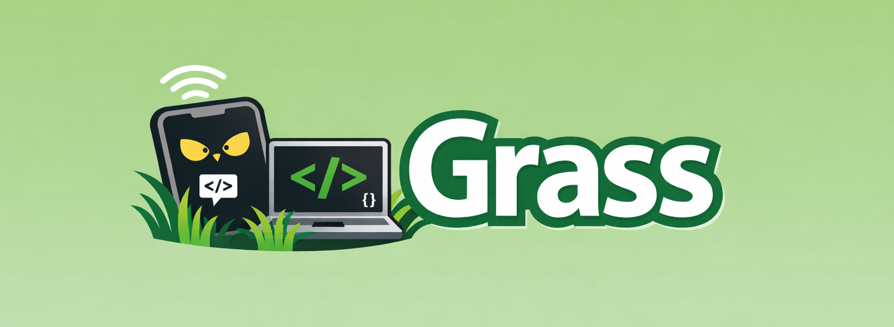

<div align="center">



[](https://www.npmjs.com/package/@grass-ai/ide)

# grass

**Claude on your phone. Code on your machine.**

Run one command. Scan a QR code. Start prompting Claude from any device — while it works in your local project directory.

---

[Installation](#installation) · [Dispatch Skill](#set-up-grass-dispatch-use-it-from-inside-any-ai-agent) · [Quick Start](#quick-start) · [How It Works](#how-it-works) · [Commands](#commands) · [API Reference](#api-reference) · [Contributing](#contributing)

</div>

## What is Grass?

You're working on a project. You want Claude to help. But you also want to walk around, lie on the couch, or just not be glued to your laptop.

Grass gives you that. It spins up a local server that connects a chat UI to a real AI agent session — either Claude Code or Opencode — which reads your files, writes code, and runs commands. The chat runs in your browser, on any device on your network. Your phone, your tablet, whatever.

```
You on the couch          Your laptop
  (phone browser)  <--->  (grass server + AI agent)
       WiFi                    Local project directory
```

No cloud relay. No copy-pasting. Just scan and go.

## Installation

```bash
npm install -g @grass-ai/ide
```

That's it. `grass` is now available everywhere.

> [!NOTE]
> Grass requires **Node.js 18+**. The Claude Code agent requires the `claude` CLI to be installed and authenticated on your machine. The Opencode agent requires the `@opencode-ai/sdk` package.

### Build from source

```bash
git clone https://github.com/grass-ai/grass.git
cd grass/cli

npm install
npm run build
npm install -g .
```

## Set up Grass dispatch (use it from inside any AI agent)

If you already use an AI agent — Claude Code, OpenCode, etc. — you can dispatch tasks to your Grass VM without leaving it. The agent installs a small markdown skill, logs you in with an OTP, and from then on you can just say _"dispatch this task to my Grass VM"_.

**Copy the prompt below and paste it into your agent (Claude Code, OpenCode, …):**

```text
Install the grass-dispatch skill and set me up. Follow these steps exactly:

1. Make sure the @grass-ai/ide npm package is installed globally.
   Try: `npm install -g @grass-ai/ide`
   If npm is blocked, fall back to:
   `git clone https://github.com/anildukkipatty/grass-ide && cd grass-ide && npm install && npm run build && npm install -g .`

2. Find the bundled skill at `<npm root -g>/@grass-ai/ide/skills/grass-dispatch/`.
   - The canonical instructions live in `SKILL.md`.
   - The per-agent install instructions live in `adapters/`.

3. Detect which agent you are:
   - Claude Code: env `CLAUDE_CODE_VERSION` set, or `claude --version` works → follow `adapters/claude-code.md`.
   - OpenCode: env `OPENCODE_VERSION` set, or `opencode --version` works → follow `adapters/opencode.md`.
   - Otherwise: ask me which agent you're running in.

4. Install the skill per the adapter (copy SKILL.md to the correct path; for OpenCode, append it to AGENTS.md inside a `BEGIN grass-dispatch` / `END grass-dispatch` block).

5. Now load and follow `SKILL.md` immediately:
   - If `$HOME/.grass/config` (or `%USERPROFILE%\.grass\config` on Windows) already has a valid JWT, tell me "Already set up" and stop.
   - Otherwise walk me through the OTP login (auto-suggest my email from `git config user.email`, send the code, ask me for it, store the JWT).

Never print, log, or echo the JWT or OTP. Treat them as secrets.
Use `https://api.codeongrass.com/v1` as the API base URL (or `GRASS_API_URL` if set).
```

After the agent finishes, you can say things like _"dispatch a task to fix the login bug on owner/repo"_ and it will call the Grass dispatch API for you. You'll get a push notification on your phone when the task finishes.

> Cross-platform: works on macOS, Linux, and Windows. Skill content and config file live under the OS-correct user home directory.

---

## Quick Start

```bash
# Navigate to a workspace directory (parent of your repos, or a specific project)
cd ~/projects

# Start grass
grass start
```

That's it. You'll see something like:

```
Starting grass server...
  workspace: /Users/you/projects
  port: 32100 (auto-selected from 32100–32199)
  available agents: claude-code, opencode

  Local Network  http://192.168.1.42:32100

  ▄▄▄▄▄▄▄▄▄▄▄▄▄▄▄
  █ ▄▄▄▄▄ █ █ █ █
  █ █   █ █▄█ █ █
  █ ▄▄▄▄▄ █ ▄▄█ █
  ▀▀▀▀▀▀▀▀▀▀▀▀▀▀▀

  Scan to open on your phone
```

Open the URL or scan the QR code. From the chat UI, select a repository and an agent, then start prompting.

## How It Works

Grass runs a single HTTP server that handles everything:

1. **Serves a chat UI** — A full-featured React app, embedded directly in the binary. No separate frontend to deploy.
2. **Manages a workspace** — Grass treats the directory where you run `grass start` as a workspace. It can list the subdirectories as repos, browse their file trees, read files, and clone new repos into the workspace.
3. **Bridges to AI agents** — Each chat session creates a real agent session via the Claude Agent SDK (for Claude Code) or the Opencode SDK. The agent sees your project files, can edit code, run commands — everything it normally does.
4. **Streams events to the UI** — Agent output is delivered via Server-Sent Events (SSE), so the UI receives a live stream of assistant messages, tool calls, permission requests, and status updates.

The connection is local. Your prompts go from your browser, over your WiFi, to the grass server running on your machine. Nothing leaves your network (except the agent's own API calls to Anthropic or its configured provider).

### Sessions are persistent

Close your browser tab. Your phone dies. The WiFi drops. It doesn't matter — your agent session keeps running on your machine. When you reconnect, you pick up right where you left off. Claude Code session history is loaded from its transcript files on disk; Opencode history is fetched from its local server.

### Permissions are forwarded to you

When the agent wants to do something that needs approval (run a bash command, edit a file, fetch a URL), you'll see a permission prompt right in the chat UI. You approve or deny from your phone. You stay in control.

### Automatic port selection

Grass no longer requires you to specify a port. It auto-selects an available port from the range `32100–32199`. This means multiple grass instances can run simultaneously in different directories. You can still specify a port with `-p` if needed.

---

## Commands

### `grass start`

The main command. Starts the HTTP server with SSE event streaming.

```bash
grass start [options]
```

| Flag | Description |
|---|---|
| `-n, --network <type>` | IP address source for the QR code URL |
| `-p, --port <number>` | Specific port to listen on (default: auto-select from 32100–32199) |
| `-c, --caffeinate` | Prevent macOS sleep for 8 hours while the server is running |

**Network options:**

| Value | Behavior |
|---|---|
| `local` (default) | Uses your machine's LAN IP |
| `tailscale` | Uses your Tailscale IP (requires Tailscale running) |
| `remote-ip` | Fetches your public IP from `api.ipify.org` |
| Any string | Used as-is (e.g., a custom hostname) |

**Examples:**

```bash
# Default — auto-selected port, LAN IP, great for phone on same WiFi
grass start

# Specify a port
grass start -p 3000

# Use Tailscale for remote access
grass start --network tailscale

# Keep your Mac awake while coding from the couch
grass start --caffeinate

# Use a custom domain
grass start --network mybox.local
```

### `grass sync`

Sync project to cloud. *(Currently a preview/demo — not yet functional.)*

### `grass ls`

List available sandboxes. *(Currently a preview/demo — not yet functional.)*

---

## API Reference

Grass exposes a REST + SSE API. All endpoints return JSON unless noted.

### Workspace & Infrastructure

| Method | Path | Description |
|---|---|---|
| `GET` | `/health` | Returns `{ status: "ok", cwd }` |
| `GET` | `/agents` | Returns `{ agents: string[] }` — list of available agents |
| `GET` | `/repos` | List subdirectories of the workspace as `{ name, path, isGit }[]` |
| `GET` | `/repos/details?repoPath=<path>` | Returns `{ branch, lastCommit, dominantLanguage }` for a specific repo |
| `POST` | `/repos/clone` | Clone a git repo into the workspace. Body: `{ url }`. Returns `{ path, name }` |
| `POST` | `/folders` | Create an empty folder in the workspace. Body: `{ name }`. Returns `{ path, name }` |
| `GET` | `/dir?repoPath=<path>&path=<subpath>` | List directory entries (files and folders) within a repo. Path is validated to stay inside `repoPath`. |
| `GET` | `/file?repoPath=<path>&path=<filePath>` | Read a file. Path is validated to stay inside `repoPath`. 5 MB max. |
| `GET` | `/diffs?repoPath=<path>` | Returns `git diff HEAD` output for a repo as `{ diff }` |

### Sessions

| Method | Path | Description |
|---|---|---|
| `GET` | `/sessions?agent=<agent>&repoPath=<path>` | List past sessions for a repo and agent |
| `GET` | `/sessions/:id/history?agent=<agent>&repoPath=<path>` | Load message history for a session |
| `GET` | `/sessions/:id/status` | Returns `{ streaming: boolean }` |
| `POST` | `/sessions/:id/abort` | Cancel an in-progress session |
| `POST` | `/sessions/:id/permission` | Respond to a permission request. Body: `{ toolUseID, approved: boolean }` |

### Chat

| Method | Path | Description |
|---|---|---|
| `POST` | `/chat` | Start or continue a session. Body: `{ repoPath, agent, prompt, sessionId? }`. Returns `{ sessionId }` |

### Streaming Events

| Method | Path | Description |
|---|---|---|
| `GET` | `/events?sessionId=<id>` | SSE stream for a specific session. Supports `Last-Event-ID` for reconnect/replay. |
| `GET` | `/permissions/events` | Global SSE stream of all pending permission requests across all active sessions |

#### SSE Event Types (`/events`)

| Event type | Payload fields | Description |
|---|---|---|
| `user_prompt` | `prompt` | The prompt that was sent to the agent |
| `system` | `subtype`, `data` | Agent session initialized |
| `assistant` | `content` | Streaming assistant text |
| `tool_use` | `tool_name`, `tool_input` | Agent is calling a tool |
| `status` | `status`, `tool_name?` | Activity indicator ("thinking", "tool") |
| `permission_request` | `toolUseID`, `toolName`, `input` | Agent is requesting permission |
| `result` | `subtype`, `cost`, `duration_ms`, `num_turns` | Query complete (success or error) |
| `done` | — | Session finished |
| `aborted` | `message` | Session was cancelled |
| `error` | `message` | An error occurred |
| `agent_error` | `message` | Agent-side error (opencode) |

Events include a `seq` field and are delivered with SSE `id:` headers so clients can use `Last-Event-ID` to resume a stream without missing events.

#### SSE Event Types (`/permissions/events`)

| Event type | Payload fields | Description |
|---|---|---|
| `permissions` | `permissions[]` | Full snapshot of all pending permissions across all sessions |

Each permission entry includes `sessionId`, `agent`, `repoPath`, `repoName`, `toolUseID`, `toolName`, and `input`.

---

## Architecture

```
┌─────────────────────────────┐
│  Browser (any device)       │
│  React chat UI              │
│  ─ repo + agent picker      │
│  ─ markdown rendering       │
│  ─ syntax highlighting      │
│  ─ permission modals        │
│  ─ diff viewer              │
│  ─ file browser             │
└──────────┬──────────────────┘
           │ HTTP + SSE
           │ (single port: 32100–32199)
┌──────────▼──────────────────┐
│  Grass Server               │
│  ─ workspace management     │
│  ─ session management       │
│  ─ tool permission relay    │
│  ─ SSE event streaming      │
│  ─ repo details + file API  │
└──────┬───────────┬──────────┘
       │           │
  Claude SDK   Opencode SDK
┌──────▼──────┐ ┌──▼──────────────┐
│ Claude Code │ │ Opencode Server │
│  agent      │ │  agent          │
└─────────────┘ └─────────────────┘
```

### Transport: SSE instead of WebSocket

Grass uses **Server-Sent Events (SSE)** for streaming, not WebSockets. The client sends requests via regular HTTP POST and receives the response stream via a GET `/events` connection. This means:

- Standard HTTP — works through proxies and most network configurations
- The `Last-Event-ID` header lets clients reconnect and replay any buffered events they missed
- The `/permissions/events` endpoint provides a single global stream for all pending permissions, useful for building dashboard-style UIs that manage multiple sessions at once

### Session Management

Sessions are the core abstraction. A session is created when a `/chat` POST is received, and lives in memory on the server.

- **Persistence** — Sessions survive client disconnects. If the browser closes mid-query, the agent keeps running. When the client reconnects, it can replay buffered events using `Last-Event-ID`.
- **Resumption** — Clients can resume prior sessions by passing `sessionId` to `/chat`. For Claude Code, the SDK resumes from the `.jsonl` transcript file on disk. For Opencode, the SDK resumes from its local session store.
- **Multi-repo** — Each session is scoped to a `repoPath`. The agent runs with that directory as its working directory.
- **Idle cleanup** — Automatic cleanup is currently disabled. Sessions are kept in memory indefinitely (cleanup will be re-enabled once a race-condition-free implementation is ready).
- **Abort** — `POST /sessions/:id/abort` cancels a running session. For Claude Code, this signals an `AbortController`. For Opencode, it calls the SDK abort endpoint and immediately marks the session done.

### Multi-Agent Support

Grass detects which agents are available at startup by checking for the `claude` CLI and the `@opencode-ai/sdk` package. It reports the available agents at `/agents`.

**Claude Code** (`claude-code`): Uses the `@anthropic-ai/claude-agent-sdk` `query()` function. Runs the `claude-opus-4-6` model in `default` permission mode. Supports `canUseTool` for per-tool permission prompts. Session transcripts are stored at `~/.claude/projects/<cwd>/<session-id>.jsonl`.

**Opencode** (`opencode`): Uses the `@opencode-ai/sdk`. Grass spawns an Opencode server process at startup (or connects to one already running on port 4096). Per-directory clients are maintained so sessions can be scoped to different repos simultaneously. Events are received via a persistent Opencode event stream (`client.event.subscribe()`). If the stream fails, it reconnects automatically after 2 seconds.

### Repo Details

`GET /repos/details?repoPath=<path>` returns metadata about a git repository without loading its full file tree:

- **`branch`** — current HEAD branch name
- **`lastCommit`** — message, hash, and timestamp of the most recent commit
- **`dominantLanguage`** — the most common file extension in the repo (determined by `git ls-files`, so it respects `.gitignore`)

### File System API

`GET /dir` and `GET /file` provide a sandboxed file browser. Both endpoints validate that the requested path is inside the given `repoPath` before serving anything, preventing path traversal. `readFile` enforces a 5 MB cap.

### Session Titles

When listing Claude Code sessions, Grass first looks for a `custom-title` entry in the session's `.jsonl` transcript. If found, that title is used as the session preview. Otherwise, it collects text from the first few user and assistant messages to build a ~80-character preview string.

### Chat UI Features

The UI is a self-contained React app embedded in the server binary. No build step, no separate deployment.

- **Repo + agent picker** — select which repository and agent to use before starting a chat
- **Markdown rendering** with syntax-highlighted code blocks (via `marked` + `highlight.js`)
- **Light/dark theme** toggle (persisted in `localStorage`, respects system preference)
- **Session picker** — browse and resume prior conversations
- **Diff viewer** — full-screen file-by-file git diff display with syntax highlighting
- **File browser** — browse the repo file tree and read file contents from within the UI
- **Permission modals** — approve/deny the agent's tool usage with formatted previews (including diff previews for file edits)
- **Activity indicators** — animated status showing what the agent is doing ("Thinking", "Reading file", "Running bash")
- **Cost tracking** — each response shows API cost and duration
- **Mobile-first** — safe-area insets, touch targets, disabled zoom, `100dvh` layout
- **Auto-reconnect** — exponential backoff with connection status indicator

## Project Structure

```
cli/
├── src/
│   ├── index.ts           # CLI entrypoint (commander setup)
│   ├── server.ts          # HTTP request routing, session lifecycle
│   ├── server-common.ts   # Shared: HTTP server, SSE, session store, workspace routes
│   ├── start-claude-code.ts  # Claude Code agent integration
│   ├── start-opencode.ts  # Opencode agent integration
│   ├── workspace.ts       # Repo listing, file browser, git details, clone
│   ├── client-html.ts     # Embedded React chat UI
│   ├── sync.ts            # Sync command (preview)
│   ├── ls.ts              # List command (preview)
│   └── progress.ts        # Progress bar + QR utilities
├── dist/                  # Compiled output (CommonJS)
├── package.json
├── tsconfig.json
└── CLAUDE.md              # Project instructions for Claude Code
```

## Tech Stack

| Component | Technology |
|---|---|
| Language | TypeScript (CommonJS, ES2020) |
| CLI | Commander v14 |
| Transport | HTTP + Server-Sent Events (SSE) |
| Claude AI | `@anthropic-ai/claude-agent-sdk` |
| Opencode AI | `@opencode-ai/sdk` |
| UI | React 18 (CDN), Babel standalone |
| Markdown | marked + highlight.js |
| QR codes | qrcode-terminal |

## Development

```bash
# Run in dev mode (no build step)
npm run dev -- start

# Build
npm run build

# Run built version
./dist/index.js start
```

The working directory where you run `grass start` is treated as the workspace root. Repos are the subdirectories of that workspace. You can run grass from any directory — the UI lets you pick the repo before starting a session.

## Security Considerations

> [!IMPORTANT]
> Grass has **no authentication**. Anyone who can reach the grass port on your network can interact with AI agents running on your machine, browse your project files, and read file contents. The `--network` flag controls which IP the QR code displays, but does not restrict access.
>
> Use on trusted networks only. For remote access, prefer Tailscale or similar private networking.

## Contributing

Contributions are welcome. If you want to help:

1. Fork the repo
2. Create a branch (`git checkout -b my-feature`)
3. Make your changes
4. Run `npm run build` to verify compilation
5. Open a PR

Please keep changes focused and avoid unnecessary refactoring. If you're unsure whether a change fits, open an issue first.

## License

MIT — see [LICENSE](LICENSE) for details.
